  

  <h1>Hi, I'm Frenki! 🚀</h1>
  
<b>Frontend Specialist | Logic Solver | Efficiency Lover</b>

  
   

  
  
<i>👆 All my major projects and deployed apps are displayed in the link above.</i>

 

## ⚡ About Me
I am a developer who loves finding the **fastest way** to solve complex problems. I combine the flexibility of **JavaScript** with the structure of modern frameworks to build apps that work seamlessly.

* 🔭 I’m currently working on: **Next.js & React Native projects**
* 🌱 I’m currently learning: **Advanced CI/CD Pipelines**
* ⚡ Fun fact: I believe laziness is a virtue if it leads to better automation.

## 🛠️ Languages & Tools

  
  
  
  
  

## 📈 GitHub Stats

## 🐍 Contribution Graph
