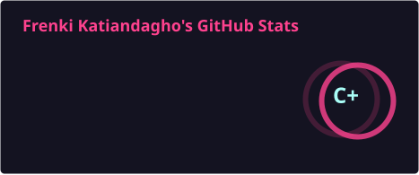

  

  <h1>Hi, I'm Frenki! 🚀</h1>
  
<b>Cybersecurity & Systems Developer | Golang • Python • C | 20+ Years Technical Diagnostics</b>

  
   

  
  
<i>👆 Explore my security tooling, cryptographic utilities, embedded controllers, and live project demos.</i>

 

## ⚡ About Me
I am a **Cybersecurity & Systems Developer** combining low-level systems engineering (**Golang, Python, C**) with 20+ years of mission-critical electronics, telemetry, and diagnostics from high-reliability industrial environments.

Currently completing the curriculum at **kood/Sisu** (Finland), bridging the gap between hardware registers, defensive software tooling, and modern application security.

* 🔭 **Currently building:** Real-time embedded systems in **Pure C** (an elevator control system featuring direct register manipulation, hardware interrupts, state machines, and motor control on Arduino Mega2560).
* 🌱 **Specialization & Focus:** Cybersecurity (cryptographic tools, polymorphic evasion analysis, defensive tooling) and low-level systems programming (**Golang, Python, C**).
* ⚙️ **Industrial Experience:** 20 years diagnosing complex electronic control units, machine telemetry, and ECM firmware using CAT ET III, Cummins INSITE, and VIMS.
* ⚡ **Fun fact:** Diagnosing register state machines and memory bugs requires the exact same root-cause logic as troubleshooting a 400-ton mining excavator—just with cleaner hands.

## 🛠️ Languages & Tools

### 🛡️ Core Languages, Systems & Security

  
  
  
  
  

### 🌐 Full-Stack & Infrastructure

  
  
  
  
  
  
  
  

## 📈 GitHub Stats

## 🐍 Contribution Graph
<picture>
  <source media="(prefers-color-scheme: dark)" srcset="./profile/github-contribution-grid-snake-dark.svg" />
  <source media="(prefers-color-scheme: light)" srcset="./profile/github-contribution-grid-snake.svg" />
  
</picture>